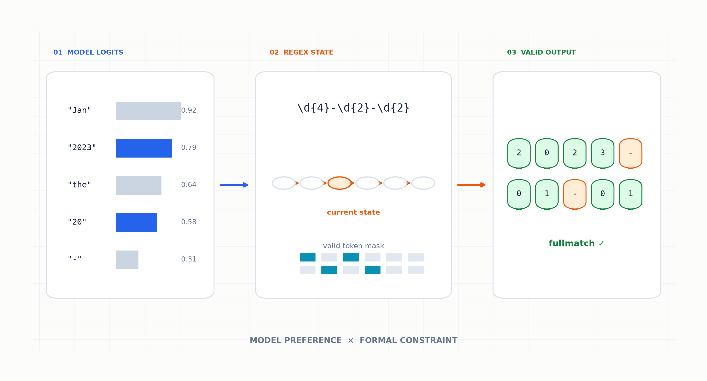
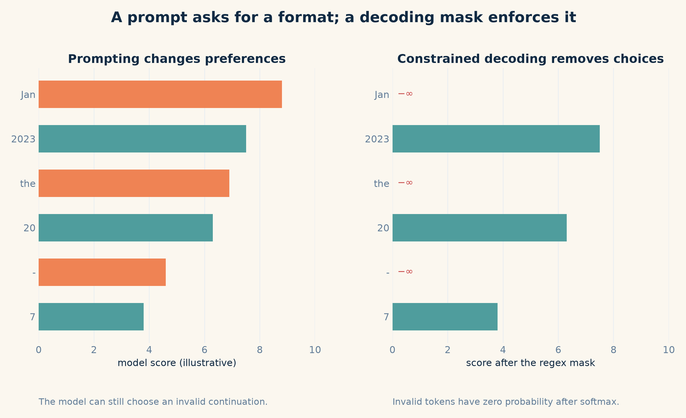
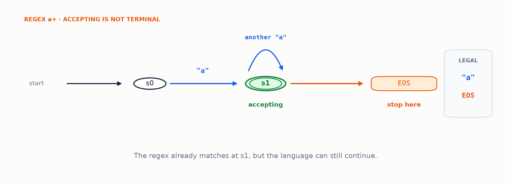
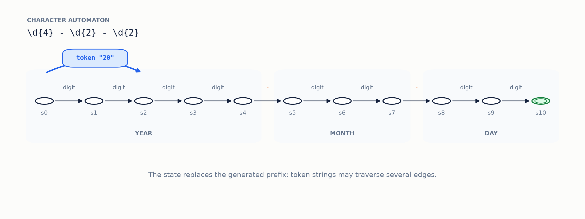
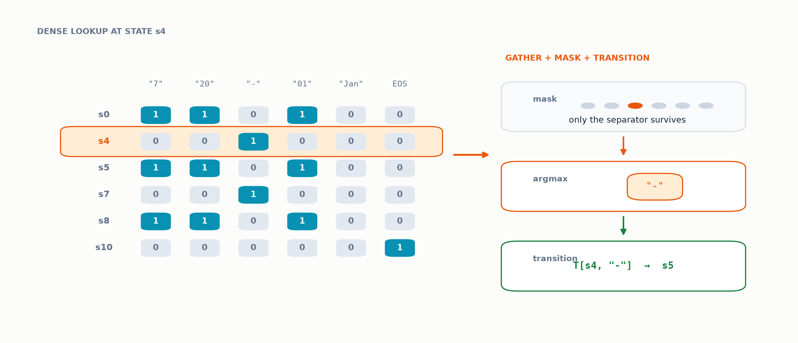
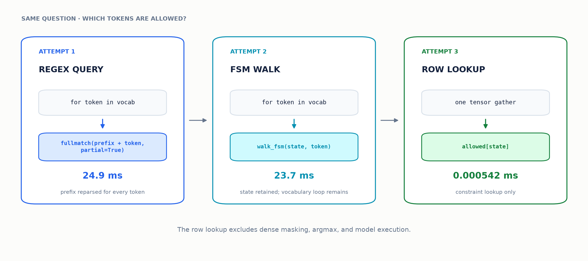
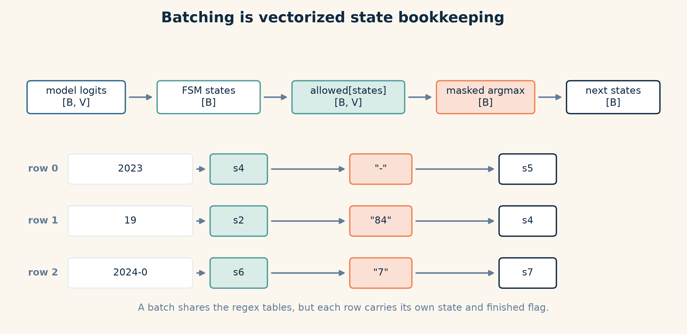

# Building Regex-Constrained Decoding from Scratch

*Finite-state machines, token masks, KV caching, batching, and the tokenizer edge cases that remain*



You ask a language model to return a date in `YYYY-MM-DD` format. The date is buried inside a larger response:

```text
The release date was January 1, 2023.
```

The answer may be helpful to a human, but it is unusable to a program expecting exactly ten characters. Asking more sternly—“only output the date, no other text”—improves the odds. It does not change what the decoder is *allowed* to produce.

I ran into this distinction while learning how decoding algorithms work below the `generate()` abstraction. My understanding felt too dependent on library APIs, so I built a small package called [`lmdec`](https://github.com/SkAndMl/lmdec). Its first public function, `regex_generate`, performs batched greedy generation constrained by a regular expression. The code is intentionally small enough to read in one sitting.

The clean final loop hides the hard part. One optimization initially made the constraint check slower, the dense lookup table moved work rather than deleting it, and real tokenizer behavior exposed a Unicode hole that remains open.

I'll show the result first, then explain how it works. With [`HuggingFaceTB/SmolLM2-135M-Instruct`](https://huggingface.co/HuggingFaceTB/SmolLM2-135M-Instruct), two prompts, and the pattern `\d{4}-\d{2}-\d{2}`, the current implementation produced:

```python
["2023-01-01", "2023-01-01"]
```

Both strings match the regex. That is the exact guarantee—not that the model knows the correct release dates, and not even that every matching string is a valid calendar date.

## Contents

- [Prompts change probabilities; constraints change the support](#prompts-change-probabilities-constraints-change-the-support)
- [Two alphabets](#two-alphabets)
- [Attempt 1: ask the regex engine every time](#attempt-1-ask-the-regex-engine-every-time)
- [Attempt 2: track the state, not the string](#attempt-2-track-the-state-not-the-string)
- [Attempt 3: precompute every state-token answer](#attempt-3-precompute-every-state-token-answer)
- [The model loop dominates](#the-model-loop-dominates)
- [One table, many states](#one-table-many-states)
- [The complete decoding loop](#the-complete-decoding-loop)
- [What the measurements say](#what-the-measurements-say)
- [Using `regex_generate`](#using-regex_generate)
- [Where the bridge still breaks](#where-the-bridge-still-breaks)
- [What I would build next](#what-i-would-build-next)

## Prompts change probabilities; constraints change the support

At decoding step `t`, a causal language model assigns a logit `z_v` to every token `v` in its vocabulary. Greedy decoding chooses the token with the largest logit; sampling draws from their softmax probabilities.

A good prompt can push the probability mass toward date-shaped tokens. But tokens such as `"The"`, `"January"`, or a newline still have nonzero probability. Regex-constrained decoding constructs an allowed set `A(s_t)` from the current constraint state `s_t` and changes the logits before selection:

$$
\tilde{z}_v =
\begin{cases}
z_v, & v \in A(s_t) \\
-\infty, & v \notin A(s_t).
\end{cases}
\tag{1}
$$

After softmax, every invalid token has probability zero. The model still decides *which valid continuation it prefers*. The decoder decides which continuations exist.


*Figure 1: Prompting can make a format likely; setting invalid logits to −∞ makes violations impossible under the decoder. Scores are illustrative. (Diagram by author)*

This distinction is my first rule for structured generation: **use prompts for meaning and decoding constraints for syntax**. Confusing the two produces systems that work in a demo and fail when their output becomes somebody else's input.

## Two alphabets

**A regex consumes characters. A language model emits tokens. Everything in this post is an attempt to bridge those two alphabets—and the bridge is still not closed.**

For the pattern `\d{4}-\d{2}-\d{2}`, you might say that the first four decoding steps must choose digits. A tokenizer may instead contain tokens for `"2"`, `"20"`, `"2023"`, or a longer string that spans several regex transitions. Conversely, one visible character can require multiple tokens.

The decoder first needs a text representation for every vocabulary item:

```python
def build_id_to_str(tokenizer, vocab_size: int) -> dict[int, str]:
    id_to_str = {}
    for token_id in range(min(len(tokenizer), vocab_size)):
        raw_token = tokenizer.convert_ids_to_tokens(token_id)
        id_to_str[token_id] = tokenizer.convert_tokens_to_string([raw_token])
    return id_to_str
```

The constraint doesn't ask, “Is token ID 341 valid?” It asks, “If the string represented by token 341 is appended here, can the regex still match?”

I'll try three versions of that operation: ask the regex engine, walk a state machine, and look up a precomputed answer. The last section returns to this token-to-string bridge, because it is also where the current implementation still fails.

## Attempt 1: ask the regex engine every time

My first implementation was deliberately slow. I used the third-party [`regex`](https://github.com/mrabarnett/mrab-regex) package because it supports partial matches. A partial match is a string that either already matches the whole pattern or could do so if more characters were appended.

At every decoding step, I appended each vocabulary string to the generated prefix and asked whether the result was still a possible full match:

```python
valid_ids = []

for token_id, token in id_to_str.items():
    match = regex_pattern.fullmatch(generated + token, partial=True)
    if match is not None:
        valid_ids.append(token_id)

mask = torch.zeros_like(next_token_logits, dtype=torch.bool)
mask[:, valid_ids] = True
masked_logits = next_token_logits.masked_fill(~mask, -float("inf"))
```

This is a good first version. It mirrors the definition of the problem, it's easy to check, and it produces a list of allowed token IDs that can be inspected directly. I would build it this way again.

It also repeats nearly all of its work. If the generated prefix has length `L`, the vocabulary contains `V` tokens, and the average candidate token contains `K` characters, then one decoding step repeatedly examines strings of roughly `L + K` characters. Over `T` generated tokens, the rough Python-side work grows like

$$
O\!\left(\sum_{t=1}^{T} V(L_t + K)\right).
\tag{2}
$$

The prefix has already been validated at the previous step, yet it gets reparsed once for every candidate token.

The first version also contained a subtler semantic mistake. It stopped as soon as the generated text fully matched the regex. That works for a fixed-length pattern such as a date.

An **accepting state** is one whose consumed prefix already satisfies the regex, so ending the sequence there is legal. For `a+`, the prefix `a` is accepting, but `aa`, `aaa`, and longer strings are valid too.

**Accepting does not mean terminal.** A terminal accepting state has no outgoing character transitions, so only EOS remains. An accepting state with outgoing edges may choose EOS or continue. The model decides which.


*Figure 2: After one `a`, the regex is already satisfied, but EOS and another `a` are both legal next steps. (Diagram by author)*

The prefix is reparsed every step, and “does it match?” turned out to be the wrong question. I needed a compact representation of everything that could legally happen next.

## Attempt 2: track the state, not the string

A regular expression describes a regular language, so it can be represented by a finite-state machine. I use [`interegular`](https://github.com/MegaIng/interegular) to parse the pattern and construct that machine:

```python
fsm = interegular.parse_pattern(regex).to_fsm()
current_state = fsm.initial
```

For a fixed-width date, the useful intuition is a chain. Four digit transitions consume the year, a hyphen transition consumes the separator, and the same process repeats for month and day.


*Figure 3: The current state summarizes the entire valid prefix, while a single tokenizer token such as `"20"` may traverse multiple character transitions. (Diagram by author)*

The machine's transition function $\delta(s, c)$ consumes one character `c`. Tokens are strings, so I extend it by folding over all characters in a token:

$$
\delta^*(s, c_1 c_2 \ldots c_k)
= \delta(\ldots\delta(\delta(s,c_1),c_2)\ldots,c_k).
\tag{3}
$$

In `interegular`, `fsm.alphabet` maps each character to an equivalence-class symbol; characters that behave the same way in the regex share a symbol. Then `fsm.map[state]` maps those symbols to the next states.

The token walk follows those two maps. A failed transition returns `None`:

```python
def walk_fsm(state: int, fsm, text: str) -> int | None:
    for char in text:
        symbol = fsm.alphabet[char]
        if symbol not in fsm.map[state]:
            return None
        state = fsm.map[state][symbol]
    return state
```

After selecting a token, I run that walk once more and retain only the resulting FSM state. The generated prefix no longer appears in the inner validation loop; each candidate walk starts at the current state and examines only the candidate token string.

I expected this change alone to make masking obviously faster. It didn't. On the SmolLM2 tokenizer's 49,152-token vocabulary, at the prefix `2023-`, the original partial-regex check took a median **24.9 ms**. Rescanning the full prefix through the FSM took **50.1 ms**—about 2× slower than the partial-regex baseline—and tracking the current state reduced it to **23.7 ms**.

The state-machine version improved the asymptotic story but barely changed this small case in Python. **A better representation is not automatically a faster implementation.** The Python loop still visited the entire vocabulary on every step.

The next attempt had to remove that loop from generation altogether.

## Attempt 3: precompute every state-token answer

For a fixed regex and tokenizer vocabulary, the answer to “Can token `v` be consumed from state `s`?” never changes during generation. So I compute it once for every `(state, token)` pair.

The implementation creates two dense tensors. `allowed[s, v]` says whether token `v` can be consumed from state `s`. `transition[s, v]` stores the resulting state, or `-1` when the pair is invalid.

For accepting states, EOS is allowed and transitions back to the same state. That self-transition will matter once several rows share a batch.


*Figure 4: Precomputation separates the two questions needed at every decoding step: which tokens are selectable, and where each selected token moves the FSM. (Diagram by author)*

The generation-time lookup becomes tensor indexing:

```python
# current_fsm_states: [batch_size]
# allowed:            [num_states, vocab_size]
# transition:         [num_states, vocab_size]

mask = allowed[current_fsm_states]                 # [batch_size, vocab_size]
masked_logits = next_token_logits.masked_fill(~mask, -float("inf"))
next_tokens = masked_logits.argmax(dim=-1)          # [batch_size]
current_fsm_states = transition[current_fsm_states, next_tokens]
```

For the date regex, selecting the precomputed row took a median **0.000542 ms** in my microbenchmark. That number measures only constraint-table lookup, not `masked_fill`, `argmax`, or the model forward pass, all of which still touch vocabulary-sized tensors. It would be misleading to call it the end-to-end masking latency.


*Figure 5: Tracking the FSM state removes prefix rescans but not the vocabulary loop; only precomputation removes that loop from generation. The row-lookup timing excludes masking and model work. (Diagram by author)*

The work has moved to initialization. Building the token-string map took **52.0 ms** and constructing the tables took another **276.9 ms**.

For 11 states and a 49,152-token vocabulary, the Boolean `allowed` tensor plus the `int64` `transition` tensor occupied **4.64 MiB**. This is worth it when a pattern is reused across many tokens or requests.

It is less attractive for a one-token completion or a regex with many states. The current function also rebuilds these tables on every call, so caching them by `(regex, tokenizer, vocabulary)` is an obvious next improvement.

My second rule is therefore: **compile what is static**. Don't perform regex-engine work inside a token loop if the regex and vocabulary are unchanged.

At this point the constraint lookup is negligible. That raises the next question: what work now dominates generation?

## The model loop dominates

My early implementation appended every selected token to `input_ids` and passed the entire sequence through the model again. It recomputes the whole prompt on every step.

Transformers expose key-value states from previous attention layers as `past_key_values`. After the first forward pass, the next iteration can send only the newly selected token while reusing the cached keys and values for the prompt and previous output.

The [Hugging Face cache documentation](https://huggingface.co/docs/transformers/kv_cache) describes the same repeated-computation problem and the available cache strategies.

On CPU with four PyTorch threads, a 128-token prompt, ten generated tokens, and SmolLM2-135M-Instruct, recomputing the full prefix took a median **3.59 seconds** across five runs. Reusing the KV cache took **456 ms**, a **7.87× speedup**. Model loading and regex-table construction were excluded so the measurement isolates the generation loop.

The exact factor is specific to this model, prompt length, output length, hardware, and thread count. The reusable lesson isn't the exact factor. Constrained decoding doesn't excuse an inefficient model loop; the transformer forward pass still dominates.

My third rule is: **cache what is repeated**—first in the constraint, then in the model.

With one prompt working efficiently, the next question is whether one compiled table can serve many prompts at once.

## One table, many states

A batch is a vector of state machines. Tokenizing a list of prompts and obtaining logits shaped `[batch_size, vocab_size]` is the easy part. The difficulty is that every row progresses independently.

One row may have generated `2023`, another `19`, and another `2024-0`. They share the same `allowed` and `transition` tables, but their current states differ. Tensor indexing handles that cleanly:

```python
mask = allowed[current_fsm_states]  # one vocabulary mask per row
```


*Figure 6: Batching shares the compiled regex but not decoding progress; each row requires its own FSM state, completion flag, and generated length. (Diagram by author)*

Completion bookkeeping caused the more interesting bug. Suppose row 0 selects EOS while row 1 needs three more tokens. The model still expects a rectangular batch on the next step, so I force row 0 to select EOS forever:

```python
mask[finished] = False
mask[finished, eos_token_id] = True
```

I separately track `generated_length` for every row and slice away these padding EOS steps during decoding. Without that length vector, finished rows either accumulate garbage tokens or force the whole batch to stop early.

The tests now cover a row finishing while another continues, independent per-row FSM progress, and the case where one row has no valid continuation.

At the public API boundary, four repeated ~128-token prompts took a median **2.95 seconds** as four sequential `regex_generate` calls and **1.68 seconds** as one batch of four, a **1.75× throughput improvement** across three runs.

This measurement includes per-call tokenizer and FSM setup, so the batched call benefits both from model batching and from compiling the constraint once instead of four times. I haven't separated those two effects yet.

With caching and per-row state both introduced, the complete loop no longer needs to hide any mechanism.

## The complete decoding loop

Greedy decoding is now short enough to fit on one screen. This is the core of `regex_generate`, simplified to emphasize the state changes:

```python
past_key_values = None

for _ in range(max_new_tokens):
    with torch.inference_mode():
        outputs = model(
            input_ids=input_ids,
            attention_mask=attention_mask,
            use_cache=True,
            past_key_values=past_key_values,
        )

    logits = outputs.logits[:, -1, :]              # [batch_size, vocab_size]
    mask = allowed[current_fsm_states]             # [batch_size, vocab_size]

    mask[finished] = False
    mask[finished, eos_token_id] = True

    if (~mask.any(dim=-1)).any():
        raise RuntimeError("No valid continuation available")

    next_tokens = logits.masked_fill(
        ~mask, -float("inf")
    ).argmax(dim=-1, keepdim=True)                  # [batch_size, 1]

    finished |= next_tokens.squeeze(-1) == eos_token_id
    current_fsm_states = transition[
        current_fsm_states, next_tokens.squeeze(-1)
    ]

    input_ids = next_tokens
    past_key_values = outputs.past_key_values
```

Three details carry more weight than their line count suggests.

**EOS is part of the constraint.** It is valid only from an accepting FSM state. Otherwise a high EOS logit could terminate an incomplete string. An accepting state with outgoing edges may choose either EOS or another valid token; a terminal accepting state has only EOS available.

**A missing continuation is an error, not a sampling opportunity.** If a row has no allowed token, taking `argmax` over all −∞ values hides the real problem. The function raises immediately.

**Validate the final artifact.** After decoding token IDs back into text, the implementation applies Python's `re.fullmatch`. This catches token-string reconstruction mistakes and too-small `max_new_tokens` values at the API boundary.

That final check doesn't prove that the FSM compiler and Python's regex engine agree on every supported pattern. I return to that mismatch below.

## What the measurements say

All measurements below were collected on an Apple Silicon MacBook Pro using CPU execution, four PyTorch threads, SmolLM2-135M-Instruct, and its 49,152-token vocabulary. They are small local experiments, not a general benchmark suite.

The FSM timings measure one full-vocabulary validity pass at prefix `2023-`. The table-lookup result covers constraint lookup only; it excludes dense masking and model work.

The cache result covers ten generated tokens after a 128-token prompt; model loading and constraint setup are excluded. The batch result measures end-to-end `regex_generate` calls with the model already loaded.


*Figure 7: Precomputation, KV caching, and batching reduce different costs; only the last two numbers measure model execution. (Diagram by author)*

The raw values and individual timing runs are stored with the post in [`benchmark-results.json`](assets/regex-constrained-decoding/benchmark-results.json). The figures are generated by [`generate_figures.py`](assets/regex-constrained-decoding/generate_figures.py).

## Using `regex_generate`

The package is available from [PyPI](https://pypi.org/project/lmdec/). The current API performs greedy generation, accepts a batch of prompts, and applies the same regex to every row:

```bash
pip install lmdec
```

```python
from transformers import AutoModelForCausalLM, AutoTokenizer

from lmdec import regex_generate

model_name = "HuggingFaceTB/SmolLM2-135M-Instruct"
tokenizer = AutoTokenizer.from_pretrained(model_name)
model = AutoModelForCausalLM.from_pretrained(model_name)

dates = regex_generate(
    model=model,
    tokenizer=tokenizer,
    prompts=[
        "The first release date is ",
        "The second release date is ",
    ],
    regex=r"\d{4}-\d{2}-\d{2}",
    max_new_tokens=10,
)

print(dates)
```

The result is guaranteed to match the regex if the function returns successfully. The model still chooses the digits. Constrained decoding can guarantee that the output *looks like* `YYYY-MM-DD`; it cannot guarantee that `2025-19-72` exists or that the answer is factually correct.

## Where the bridge still breaks

The post opened with two alphabets: regex characters and model tokens. Here is where they still disagree.

**Decoding tokens separately can change the text.** Some tokenizers use byte-level fallback tokens: vocabulary items that represent fragments of a character's encoded bytes when the character isn't available as one ordinary token. The current code assumes that decoding tokens separately and concatenating the pieces produces the same string as decoding those tokens together.

That assumption is false for the SmolLM2 tokenizer. The Unicode character `U+1F642` (slightly smiling face) becomes token IDs `[10813, 38887]`. Decoding the pair reconstructs the character.

Decoding the tokens independently produces one Unicode replacement character (`U+FFFD`) from the first token and two from the second. Concatenating the pieces therefore produces three replacement characters instead. The current FSM cannot correctly constrain that character even though the tokenizer can generate it.

Fixing this likely requires composing the constraint with the tokenizer's byte-level representation rather than treating isolated decoded strings as ground truth. This isn't a side limitation: it is the original two-alphabet problem showing up at the lowest level of the bridge.

I would describe `lmdec` as an educational implementation, not a production structured-output engine. Libraries such as [Outlines](https://github.com/dottxt-ai/outlines) cover much more of that surface. The remaining gaps are concrete.

**Regex support is a subset.** `interegular` documents unsupported backreferences, conditional matching, and incomplete handling of some lookarounds. Patterns accepted by Python's `re` module aren't automatically safe here.

**Two regex engines define correctness.** The FSM comes from `interegular`, while the final check uses Python's `re.fullmatch`. For ordinary patterns, the second check catches real mistakes. Dialect differences can still produce surprising disagreements. A mature API should define one supported syntax explicitly and reject everything outside it early.

**Dense tables scale with states times vocabulary.** The current `bool` mask and `int64` transition tensor use about `9SV` bytes before device-specific overhead. Eleven states are harmless. A large compiled grammar and a 100k-token vocabulary are a different problem. Sparse or compressed token tries would trade simpler indexing for lower memory.

**The decoder is greedy and standalone.** There is no sampling, beam search, per-row regex, streaming, or integration with Hugging Face's logits-processor interface. A logits processor is a component that changes a model's logits before token selection. The implementation also rebuilds token and FSM tables for each call.

**Syntax is not semantics.** A regex for calendar dates, numeric ranges, or JSON shape usually admits values that are structurally legal and semantically nonsense. Some constraints need a richer grammar or a semantic validator after decoding.

The implementation turns a regex into a stateful token mask and carries that state through cached, batched generation. It doesn't make per-token decoding compositional, support every regex, or solve structured generation in general.

Before deciding what to build next, these are the three rules I would carry into another constrained decoder:

- **Use prompts for meaning and decoding constraints for syntax.**
- **Compile what is static.**
- **Cache what is repeated.**

## What I would build next

The next version should cache compiled tables, make token-byte behavior correct, and expose the constraint as a reusable logits processor. After that, sampling is mechanically simple—sample from the masked distribution instead of taking `argmax`—while beam search is more interesting because FSM state must follow every reordered beam.

Beyond regex, the same loop wants a richer source of `allowed[state]`: a JSON schema, a context-free grammar, or a semantic parser. The model interface barely changes. The hard part remains the bridge between a human-readable constraint and the tokenizer's actual alphabet.

That bridge is where I am continuing the project. If you want to inspect the complete implementation rather than the reduced snippets here, it lives in the [`lmdec` repository](https://github.com/SkAndMl/lmdec).
