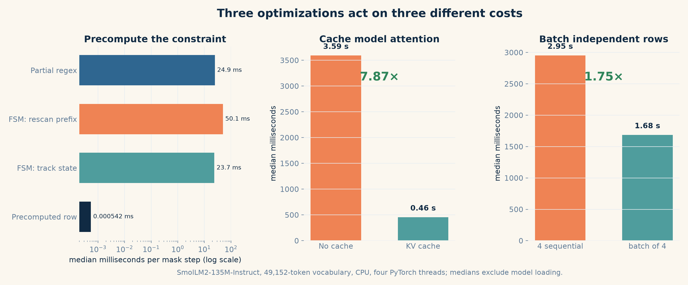

# Regex-Constrained Generation: Making Output Syntax a Decoding Rule

*Token masks, finite-state machines, precomputation, and the tokenizer boundary that remains*

Suppose a language model sits in the middle of a larger program. The next stage expects one value in `YYYY-MM-DD` form:

```python
import re


def accept_date(text: str) -> str:
    if re.fullmatch(r"\d{4}-\d{2}-\d{2}", text) is None:
        raise ValueError(f"Invalid date representation: {text!r}")
    return text
```

This small function makes the contract concrete. A response containing an explanation, a newline, or an incomplete date is not vaguely “bad for a program”; it fails a validator we can run.

I tried four versions of the same generation task with [`HuggingFaceTB/SmolLM2-135M-Instruct`](https://huggingface.co/HuggingFaceTB/SmolLM2-135M-Instruct). All four used greedy decoding and a budget of ten new tokens. The prompts were tokenized directly without applying a chat template. The first three used ordinary model generation. The fourth used the original short prompt but prevented the decoder from selecting any token that would make `\d{4}-\d{2}-\d{2}` impossible to complete.

| Prompt | Decoder constraint | Raw generated continuation | Passes `re.fullmatch`? |
|---|---|---|---|
| `Generate date` | None | `: 1990-199` | No |
| `Generate only date but nothing else` | None | `.\n\nI'm not sure if I'm` | No |
| `Generate a date in YYYY-MM-DD format and output nothing else` | None | `.` | No |
| `Generate date` | `\d{4}-\d{2}-\d{2}` | `2100-10-10` | Yes |

These are the outputs from one deterministic run on CPU with PyTorch 2.13.0 and Transformers 5.15.0. They are not a benchmark of how often prompting fails. The second prompt strengthens the instruction, while the third also states the exact surface form. Neither changes the decoder's selection rule. The point is narrower: changing the wording and changing the decoder are different interventions. In this run, the prompt-only variants failed the validator. The regex-constrained decoder produced a string inside the required language.

There is another important detail in the last output. `2100-10-10` has the right shape, but the prompt did not ask a factual question and a regex cannot decide whether a date is contextually correct. The constraint guarantees syntax. The model is still responsible for choosing among the strings that satisfy it.

That separation—model preference inside a decoder-enforced language—is the subject of this post.

## Prompting changes probabilities; constraints change the support

At decoding step `t`, a causal language model assigns a logit `z_v` to every token `v` in its vocabulary. Greedy decoding chooses the largest logit; sampling draws from the corresponding probability distribution.

A prompt can make the right format more likely, but it cannot force the model to follow that format. Even after we ask for “only” a date and “nothing else,” the model can still choose a period, a newline, or an explanation.

Regex-constrained generation prevents those tokens from being selected. Let `s_t` describe how much of the regex has been matched so far, and let `A(s_t)` contain the token IDs that can still lead to a complete match.

The model still produces a score, or logit, for every token in its vocabulary. If an invalid token keeps its original score, it can still have the largest score during greedy decoding or be selected during sampling. The mask therefore has to be applied **before** the next token is chosen.

For every token outside `A(s_t)`, we replace its logit with negative infinity:

$$
\tilde{z}_v =
\begin{cases}
z_v, & v \in A(s_t) \\
-\infty, & v \notin A(s_t).
\end{cases}
$$

Softmax converts a logit `z` into a probability using `exp(z)`. Since `exp(-∞) = 0`, every masked token receives probability zero. Greedy decoding can no longer choose it, and sampling redistributes the probability only across the tokens that remain.

So the model and the constraint have separate jobs:

- The model ranks the continuations that remain.
- The decoder removes continuations that violate the required syntax.

This sounds like a vocabulary mask. The difficult part is constructing the correct mask at every step.

## A regex reads characters; a model emits tokens

Consider the date pattern again:

```text
\d{4}-\d{2}-\d{2}
```

It describes a sequence of characters: four digits, a hyphen, two digits, another hyphen, and two digits. A language model does not necessarily produce one character per step. Its vocabulary may contain separate tokens for `"2"`, `"20"`, `"2023"`, or strings that cross several character transitions at once.

The reverse can happen too. One visible Unicode character may be represented by several tokens.

This gives us the central implementation problem:

> A regex consumes characters, while a language model emits tokens. Constrained generation has to bridge those two alphabets without admitting an invalid token or rejecting a valid one.

To decide whether a token is allowed, the decoder first needs to know which text that token would add to the output. This gives us the first step in the bridge: build a table from token IDs to their text fragments.

```text
for each token ID in the model vocabulary:
    convert the ID into the tokenizer's token
    convert that token into its text fragment
    store token ID -> text fragment
```

The constraint is no longer asking whether token ID `341` is valid in isolation. It is asking a stateful question: if the string represented by token `341` is consumed from the current regex state, does some full match remain possible?

The most direct method is to ask the regex engine that question for every candidate token.

## Ask the regex engine for every token

The third-party [`regex`](https://github.com/mrabarnett/mrab-regex) package supports partial matching. A partial match is a string that either matches the full pattern already or could match after more characters are appended.

At every decoding step, I appended each vocabulary string to the generated prefix and asked the regex engine whether the result remained viable:

```python
valid_ids = []

for token_id, token in id_to_str.items():
    match = regex_pattern.fullmatch(generated + token, partial=True)
    if match is not None:
        valid_ids.append(token_id)

mask = torch.zeros_like(next_token_logits, dtype=torch.bool)
mask[:, valid_ids] = True
masked_logits = next_token_logits.masked_fill(~mask, -float("inf"))
```

This method follows the definition of regex-constrained generation closely. Start with the text generated so far, append one candidate token, and keep that token only when the combined text can still become a full match. Repeating this for the whole vocabulary gives us the mask for the next decoding step.

The expensive part is not one regex check. It is how often the same prefix is checked again.

Suppose the generated prefix is `2023-`. To build the next mask, the decoder appends the text of the first vocabulary token to `2023-` and checks the result. It then appends the second token to the same prefix and checks again. This continues for every token in the vocabulary.

After the model chooses one token, the decoder starts another full-vocabulary pass. Most of the text being examined is generated history that was already known to be valid. As the output grows, every candidate check reads that same growing prefix again.

There are therefore two repeated loops: one over generation steps and one over the vocabulary. If the vocabulary contains `V` tokens, the generated prefix at step `t` has length `L_t`, and the average candidate token contains `K` characters, the rough Python-side work over `T` steps is

$$
O\left(\sum_{t=1}^{T} V(L_t + K)\right).
$$

The decoder does not need the prefix for its wording. It needs the prefix only to answer one question: **which characters are legal next?**

For the date regex, `2023-` and `1998-` are different strings, but they have exactly the same future. Both have completed the four-digit year and the first hyphen, so both must be followed by two digits, another hyphen, and two final digits. Once we know that both prefixes have reached the same point in the pattern, their earlier characters no longer need to be checked.

A finite-state machine stores this “point in the pattern” as a state. Prefixes that allow the same future continuations reach the same state, so the decoder can carry one state number instead of repeatedly carrying the full generated string through the regex engine.

## Track the state, not the string

### What a finite-state machine stores

A **finite-state machine** (FSM) is a small machine that reads one input symbol at a time. It starts in one state, follows a transition for each symbol it reads, and ends in another state. The state records how far the input has progressed through the pattern.

An FSM has five parts:

| Part | Meaning | `interegular` representation |
|---|---|---|
| **Alphabet** $\Sigma$ | The input symbols the FSM can read. For the date pattern, the important symbols are a digit class and `-`. | `fsm.alphabet`, a character-to-equivalence-class map |
| **States** $S$ | The finite set of possible positions in the pattern. | `fsm.states` |
| **Initial state** $s_0$ | The state before any character has been read. | `fsm.initial` |
| **Transition function** $\delta(s, c)$ | Given the current state `s` and input symbol `c`, return the next state. | `fsm.map[state][symbol]` |
| **Final states** $F$ | States where the characters read so far form a complete regex match. These are also called accepting states. | `fsm.finals` |

The FSM alphabet and the model vocabulary are different things. The **alphabet** contains the character-level symbols understood by the regex machine. The model **vocabulary** contains tokens, and each token may expand into one or more of those characters.

For `\d{4}-\d{2}-\d{2}`, the FSM can be read as this chain:

```text
initial
  s0 --digit--> s1 --digit--> s2 --digit--> s3 --digit--> s4
  s4 --hyphen--> s5 --digit--> s6 --digit--> s7
  s7 --hyphen--> s8 --digit--> s9 --digit--> s10  final
```

Both `2023-` and `1998-` finish at `s5`. From that point onward, the machine behaves identically for both prefixes. If the next character is a digit, it moves to `s6`; if the next character is not allowed by the transition function, that continuation is rejected.

The regular-expression subset used here describes a regular language, so it can be compiled into this kind of machine. I use [`interegular`](https://github.com/MegaIng/interegular) to do that:

```python
fsm = interegular.parse_pattern(regex).to_fsm()
current_state = fsm.initial
```

The transition function above consumes one character at a time. A model token is a string of zero or more characters, so one token may cross several FSM transitions. The character-level transition therefore has to be applied repeatedly across the full token:

$$
\delta^*(s, c_1c_2\ldots c_k)
= \delta(\ldots\delta(\delta(s,c_1),c_2)\ldots,c_k).
$$

`interegular` groups characters that behave identically into the same alphabet symbol. For this pattern, every allowed digit can follow the same transitions, so the FSM does not need a separate path for each digit.

Walking a token through the machine is a small loop:

```python
def walk_fsm(state: int, fsm, text: str) -> int | None:
    for char in text:
        symbol = fsm.alphabet[char]
        if symbol not in fsm.map[state]:
            return None
        state = fsm.map[state][symbol]
    return state
```

After selecting a token, the decoder stores only its resulting FSM state. On the next step, each candidate walk begins from that state and examines only the candidate token string. The generated prefix disappears from the validity check.

Using SmolLM2's 49,152-token vocabulary and the prefix `2023-`, the partial-regex implementation took a median **24.9 ms** to check the full vocabulary. Rescanning the prefix through the FSM took **50.1 ms**, which was about twice as slow. Tracking the current state reduced the time to **23.7 ms**.

Tracking one state removes the growing prefix from each check. However, the decoder still walks every candidate token through the FSM using a Python loop, once for every vocabulary entry and every generation step. The timings are therefore close: reducing the work per candidate does not remove the much larger number of candidate checks.

The FSM gives us the right state representation. The next step is to use that representation without walking the full vocabulary during generation. Since both the regex and the vocabulary stay fixed, their possible state transitions can be computed beforehand.

## Precompute every state-token answer

For a fixed regex and tokenizer, the answer to this question never changes during generation:

> If token `v` is consumed from FSM state `s`, is it valid, and which state does it reach?

So I compute the answer once for every `(state, token)` pair and store it in two dense tensors:

- `allowed[s, v]` is `True` when token `v` can be consumed from state `s`.
- `transition[s, v]` stores the resulting state, or `-1` for an invalid pair.

EOS receives special treatment. It is allowed only in accepting states. Its transition points back to the same state, which makes finished rows easier to keep inside a rectangular batch later.

The generation-time operation becomes tensor indexing:

```python
# current_fsm_states: [batch_size]
# allowed:            [num_states, vocab_size]
# transition:         [num_states, vocab_size]

mask = allowed[current_fsm_states]                  # [batch_size, vocab_size]
masked_logits = next_token_logits.masked_fill(~mask, -float("inf"))
next_tokens = masked_logits.argmax(dim=-1)          # [batch_size]
current_fsm_states = transition[current_fsm_states, next_tokens]
```

For the date regex, selecting a precomputed row took a median **0.000542 ms**. This is only the constraint-table lookup. It excludes `masked_fill`, `argmax`, and the model forward pass, all of which still touch vocabulary-sized tensors. Calling it end-to-end masking latency would be misleading.

Precomputation pays the full-vocabulary cost during initialization. Building the token-string table took **52.0 ms**, and constructing the FSM tables took another **276.9 ms**.

The date machine had 11 states. With that vocabulary, its Boolean `allowed` tensor and `int64` `transition` tensor occupied **4.64 MiB**. That is a reasonable trade when the same constraint is used across several output tokens or requests. It is less attractive for a one-token completion or a regex that compiles to many states.

The current implementation rebuilds both tables on every call. Caching them by regex, tokenizer, and vocabulary is therefore an obvious next optimization.

The general rule is simple: **compile what is static**. A regex and a tokenizer vocabulary do not change while tokens are being generated, so regex-engine work does not belong in the token loop.

Once lookup becomes this cheap, another cost becomes impossible to ignore.

## The constraint can be cheap while generation remains slow

My early generation loop appended each selected token to `input_ids` and passed the entire prompt and generated prefix through the model again. The constraint check was improving while the transformer was repeatedly computing attention for text it had already processed.

Transformers expose the key and value states from previous attention layers as `past_key_values`. After the first forward pass, the next step can send only the newly selected token while reusing the cached states for the prompt and previous output. The [Hugging Face cache documentation](https://huggingface.co/docs/transformers/kv_cache) describes the repeated computation and the available cache strategies.

On CPU with four PyTorch threads, a 128-token prompt, ten generated tokens, and SmolLM2-135M-Instruct, recomputing the full prefix took a median **3.59 seconds** across five runs. Reusing the KV cache took **456 ms**, a **7.87× speedup**.

Model loading and regex-table construction were excluded from both timings so that the measurement isolates the generation loop. The exact factor depends on the model, prompt length, output length, hardware, and thread count.

The transferable point is not the exact factor. Regex-constrained generation is still autoregressive model generation. Optimizing the constraint while recomputing the prompt at every step fixes the smaller loop and leaves the larger one untouched.

This gives the second implementation rule: **cache what is repeated**, both in the constraint and in the model.

KV caching makes one sequence efficient. Batching introduces a different state problem.

## A batch shares the machine, not its current state

The regex and precomputed tables can be shared across a batch, but each prompt has progressed to a different point in the machine. One row may have generated `2023`, another `19`, and another `2024-0`.

The decoder therefore stores one current FSM state per row:

```python
# One shared table, one state per sequence.
mask = allowed[current_fsm_states]
```

Completion bookkeeping is more subtle. Suppose row 0 selects EOS while row 1 needs three more tokens. The model still expects a rectangular batch on the next step. I keep the finished row in the batch but force it to select EOS on every remaining iteration:

```python
mask[finished] = False
mask[finished, eos_token_id] = True
```

A separate `generated_length` value for each row records where its actual output ended. Final decoding slices away the repeated EOS padding. Without per-row lengths, an early-finishing sequence either accumulates irrelevant tokens or stops every other row with it.

The tests cover independent FSM progress, one row finishing while another continues, and a batch where one row has no valid continuation.

At the public-function boundary, four repeated prompts of roughly 128 tokens took a median **2.95 seconds** as four sequential calls and **1.68 seconds** as one batch of four. That is a **1.75× throughput improvement** across three runs.

This measurement includes tokenizer and FSM setup inside every call. The batched version benefits from both model batching and compiling the constraint once instead of four times. I have not separated those two effects yet.

With the constraint state, cache state, and per-row completion state all introduced, the complete loop can now be read without relying on unexplained machinery.

## The complete decoding loop

The core greedy loop is short. Most of its behavior comes from the tensors prepared around it:

```python
past_key_values = None

for _ in range(max_new_tokens):
    with torch.inference_mode():
        outputs = model(
            input_ids=input_ids,
            attention_mask=attention_mask,
            use_cache=True,
            past_key_values=past_key_values,
        )

    logits = outputs.logits[:, -1, :]               # [batch_size, vocab_size]
    mask = allowed[current_fsm_states]              # [batch_size, vocab_size]

    mask[finished] = False
    mask[finished, eos_token_id] = True

    if (~mask.any(dim=-1)).any():
        raise RuntimeError("No valid continuation available")

    next_tokens = logits.masked_fill(
        ~mask, -float("inf")
    ).argmax(dim=-1, keepdim=True)                   # [batch_size, 1]

    finished |= next_tokens.squeeze(-1) == eos_token_id
    current_fsm_states = transition[
        current_fsm_states, next_tokens.squeeze(-1)
    ]

    input_ids = next_tokens
    past_key_values = outputs.past_key_values
```

Three details matter more than their line count suggests.

**EOS belongs to the constraint.** An accepting state means that the generated characters already form a full regex match. EOS is allowed only from such a state; allowing it earlier would return an incomplete string.

**An empty allowed set must be handled explicitly.** If a row has no allowed token, there is no meaningful next-token choice. The decoder stops and reports that the constraint cannot be continued instead of applying `argmax` to a vector of negative infinities.

**The final string is validated again.** After token IDs are decoded into text, Python's `re.fullmatch` checks the returned artifact. This guards against an output ending before the pattern is complete and against differences in token-string reconstruction at the API boundary.

That last check is useful, but it does not prove that the FSM compiler, tokenizer, and Python regex engine agree in every case. The same character-token boundary requires one more careful look.

## The measurements at a glance

The three experiments above isolate different parts of the system, so their bars should not be compared as though they were one benchmark. The constraint experiment measures a validity operation, the cache experiment measures one generation loop, and the batching experiment measures complete calls with an already-loaded model.


*Figure 1: Precomputation, KV caching, and batching reduce different costs; only the last two comparisons include model execution. (Plot by author)*

## Where the token-character bridge still breaks

The precomputed table assumes that each token can be converted to a standalone string, walked through the character-level FSM, and then composed with later token strings. That assumption is not always true.

Some tokenizers contain **byte-level fallback tokens**: tokens representing fragments of a character's encoded bytes. For these tokens, decoding pieces independently and concatenating the results can differ from decoding the full token sequence together.

The SmolLM2 tokenizer provides a concrete example. The Unicode character `U+1F642` (slightly smiling face) is encoded as token IDs `[10813, 38887]`. Decoding the pair reconstructs the character.

Decoding the two IDs independently does not. The first becomes one Unicode replacement character (`U+FFFD`) and the second becomes two replacement characters. Concatenating those strings produces three replacement characters instead of the original emoji.

The current FSM table is built from independently decoded tokens, so it cannot correctly constrain this character even though the tokenizer can produce it. Fixing the problem likely requires composing the regex with the tokenizer's byte-level representation instead of treating isolated decoded strings as ground truth.

This is not an unrelated Unicode footnote. It is the original two-alphabet problem at its lowest level: the regex consumes decoded characters, but the tokenizer may distribute one character across token boundaries.

There are several other boundaries to the current implementation.

**Regex support is a subset.** `interegular` documents unsupported backreferences, conditional matching, and incomplete support for some lookarounds. A pattern accepted by Python's `re` module is not automatically supported by the FSM compiler.

**Two regex engines participate in correctness.** `interegular` builds the FSM, while Python's `re.fullmatch` validates the final output. The second engine provides an independent check, but dialect differences can still produce surprising disagreements. A mature API should define one supported syntax and reject unsupported constructs early.

**Dense tables scale with states times vocabulary.** The current Boolean mask and `int64` transition table use roughly `9SV` bytes before device-specific overhead, where `S` is the number of states and `V` is vocabulary size. Eleven states are small. A large grammar and a 100,000-token vocabulary are not.

**The decoder is currently greedy.** Sampling would draw from the masked distribution instead of taking `argmax`. Beam search is more involved because FSM state has to follow every reordered beam.

**Syntax is not semantics.** A date-shaped string can still name a nonexistent date. Numeric ranges, cross-field dependencies, and factual correctness require a richer constraint or validation after decoding.

These limits define what the implementation does today: it turns a supported regular expression into a stateful token mask for cached, batched greedy generation. It does not make token decoding compositional, support every regex dialect, or solve structured generation in general.

## The implementation in `lmdec`

The implementation described above is available in [`lmdec`](https://github.com/SkAndMl/lmdec). The current public function accepts a model, tokenizer, batch of prompts, one regex shared across the batch, and a new-token limit:

```bash
pip install lmdec
```

```python
from transformers import AutoModelForCausalLM, AutoTokenizer

from lmdec import regex_generate

model_name = "HuggingFaceTB/SmolLM2-135M-Instruct"
tokenizer = AutoTokenizer.from_pretrained(model_name)
model = AutoModelForCausalLM.from_pretrained(model_name)

dates = regex_generate(
    model=model,
    tokenizer=tokenizer,
    prompts=["Generate date"],
    regex=r"\d{4}-\d{2}-\d{2}",
    max_new_tokens=10,
)

print(dates)
# The run at the beginning returned one regex-matching date string.
```

If the function returns successfully, every returned string passes the supplied regex. The selected string may change with the model or software version, and matching the regex does not make it semantically correct.

The implementation is deliberately small and educational. Libraries such as [Outlines](https://github.com/dottxt-ai/outlines) cover a much broader structured-generation surface.

## What I would build next

Three rules survived the implementation and the measurements:

- **Use prompts for meaning and decoding constraints for syntax.**
- **Compile what is static.**
- **Cache what is repeated.**

The next version should cache compiled tables, make byte-level token composition correct, and expose the constraint through a reusable logits processor. A logits processor changes model logits before token selection, allowing the same constraint machinery to participate in more generation strategies.

Beyond regular expressions, the loop wants a richer source of `allowed[state]`: a JSON schema, a context-free grammar, or a semantic parser. The model-facing operation remains a token mask. The hard part remains compiling a human-readable constraint into the tokenizer's actual alphabet.

That is the part I am continuing to work on.
